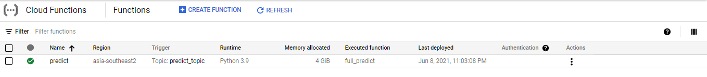
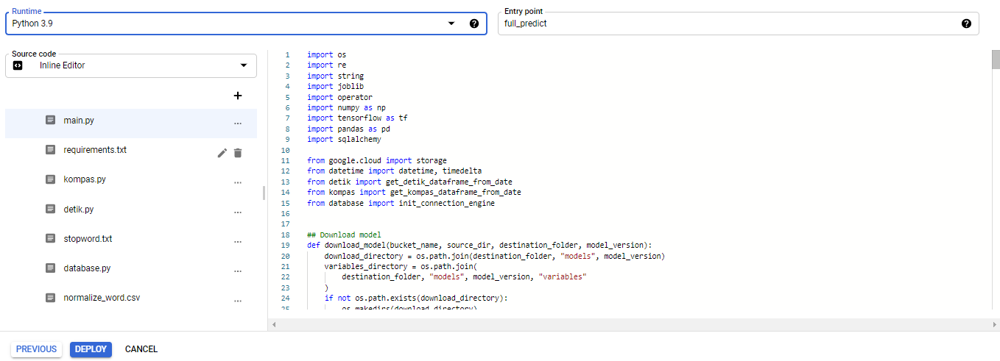

# Scraper-Service

Scraper service is a service to scrap news for a particular date, load machine learning models from Google Cloud Storage, perform prediction tasks, and save the news and their prediction to a Cloud SQL instance.

There are 3 different models that will be loaded by the service:
- Jakarta News Detection, detect whether news is related to Jakarta.
- Topic categorization, Label news to 9 different categories.
- Sentiment analysis, predict news' sentiments.
Those 3 models must be stored on Google Cloud Storage. Please refer to the  for detailed information

## Getting Started

We currently run the scraper service on Google Cloud Functions. Here is the detailed step of how to deploy this service manually to Cloud Functions and what needs to be configured:

### Trigger
We recommend to use **Cloud Pub/Sub** trigger type so you can spawn an automate scheduler for this function easily using **Cloud Scheduler**. For more information you can refer to [this link](https://cloud.google.com/community/tutorials/using-scheduler-invoke-private-functions-oidc).

### Runtime
As this function will take some time to run, set the timeout to `540` . You'll also need to set up **Runtime Environment Variables** with the following key-pair configurations:
- `BUCKET_NAME`: A bucket name of Cloud Storage where the machine learning models reside.
- `DB_USER`: Username of Cloud SQL
- `DB_PASS`: Password of Cloud SQL
- `DB_NAME`: Database name of Cloud SQL
- `CLOUD_SQL_CONNECTION_NAME`: Instance connection name of Cloud SQL

### Code
Copy all files in this directory excluding this readme and res directory. Set the runtime to **Python 3.9** and set the entry point to `full_predict`.

Then click **Deploy** to deploy the function.
